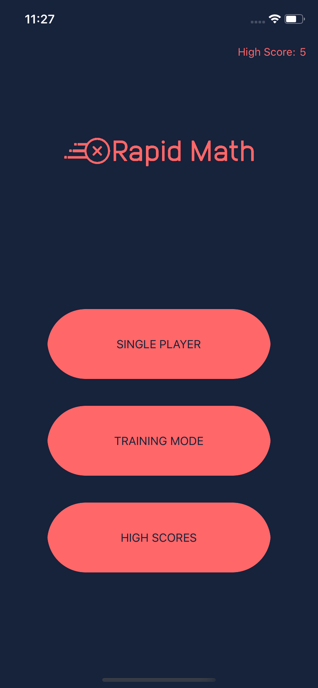

# RapidMath
This app is a personal project designed to use various elements of Swift learned and try to implement them with one another. Rapid Math is IOS App/Game designed using swift which asks users to answer basic math problems including addition and multiplication in a certain alloted time. As you progress the questions become more challenging and you have until the timer expires to answer the question.

, , 
